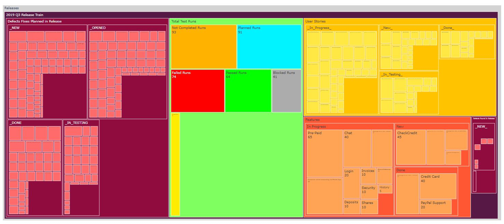
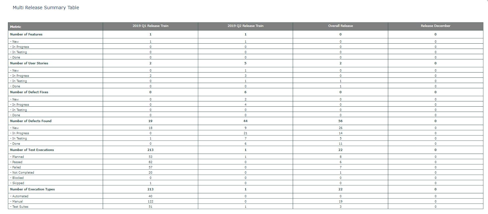
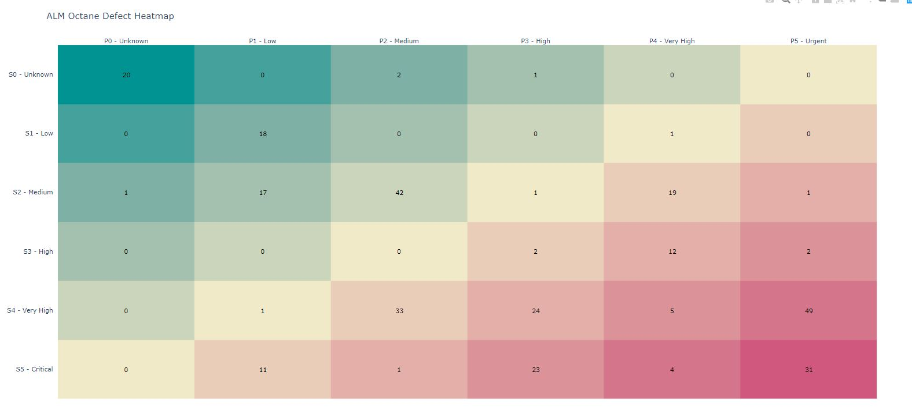

# Examples for ALM Octane REST API with Python
This repository provides example for python using ALM Octane REST API.

# BASICS
The Basics package contains a set of package to help connecting to ALM Octane using the REST API and reading, creating, changing or deleting entities (such as defects, tests, requirements, etc.)

_**Requirements**_
- Installation of Pyhton IDE, in this article PyCharm (Community Edition) is used.
- Download and Install Python, https://www.python.org/downloads/
- Install requests: pip install requests, https://pypi.org/project/requests/
- Install json: https://docs.python.org/3/library/json.html
- Generate Client Id and Client Secret for ALM Octane: https://admhelp.microfocus.com/octane/en/latest/Online/Content/AdminGuide/how_setup_APIaccess.htm- Install Flask: pip install Flask, https://pypi.org/project/Flask/

**BASICS.Authentication package**
The Authentication package contains examples on how to sign_in to and sign_out from ALM Octane. There are 2 files:
.Login and logout.py - flat example on how to connect and disconnect to / from the ALM Octane REST API
.Authenticationfunctions.py - contains the sign_in and sign_out as functions to be used in other scripts

**BASICS.defects**
The defects package contains examples on how to work with defects when using the ALM Octane REST API, i.e. Create one or more defects, read all defects, etc.

**BASICS.tests**
The tests package contains examples on how to work with tests when using the ALM Octane REST API, i.e. Create a manual test, add steps to the manual test, etc.

# External Actions
In this package, you will find alot of external actions to demonstrate the capabilities of ALM Octanes REST API combined with Python & Plotly and some other python library.

**External Actions.Release Reporting.Release Reporting.py**

_**Requirements**_
- Installation of Pyhton IDE, in this article PyCharm (Community Edition) is used.
- Download and Install Python, https://www.python.org/downloads/
- Install Flask: pip install Flask, https://pypi.org/project/Flask/
- Install Plotly: pip install plotly, https://pypi.org/project/plotly/
- Install requests: pip install requests, https://pypi.org/project/requests/
- Install json: https://docs.python.org/3/library/json.html
- Generate Client Id and Client Secret for ALM Octane: https://admhelp.microfocus.com/octane/en/latest/Online/Content/AdminGuide/how_setup_APIaccess.htm- Install Flask: pip install Flask, https://pypi.org/project/Flask/

**[RELEASE REPORTING]**

_**Releases on Timeline**_
This report generates a gannt chart and put all selected relation from ALM Octane UI on that gantt chart. The action (button for the external action editor: https://admhelp.microfocus.com/octane/en/15.0.40/Online/Content/AdminGuide/custom-buttons.htm), you can find in **External Actions.Release Reporting.external-actions-editor-json**. Just copy the content to you ALM Octane External Action Editor.

See this External Action in a short demo: https://youtu.be/3X7Tef9fgB8
external-action-name: releases-overview

_**Release Summary Treemap**_
This report generates a treemap on a single release to provide a summary on the content of a release. The action (button for the external action editor: https://admhelp.microfocus.com/octane/en/15.0.40/Online/Content/AdminGuide/custom-buttons.htm), you can find in **External Actions.Release Reporting.external-actions-editor-json**. Just copy the content to you ALM Octane External Action Editor.

See this External Action in a short demo: https://youtu.be/wgapDDCmGjs
external-action-name: release-summary

_**Release Summary Table**_
This report generates a summary table for multiple releases to provide a summary on the content of each release. The action (button for the external action editor: https://admhelp.microfocus.com/octane/en/15.0.40/Online/Content/AdminGuide/custom-buttons.htm), you can find in **External Actions.Release Reporting.external-actions-editor-json**. Just copy the content to you ALM Octane External Action Editor.

See this External Action in a short demo: https://youtu.be/Q1EBkmvzAiQ
external-action-name: release-summary-table

**[DEFECT REPORTING]**

_**Defect Heatmap**_
This report generates a heatmap for the selected ALM Octane defects. It also applies automatically the filter chosen for this heatmap, i.e. If you want to see the heatmap for a specific release, you can set the filter in ALM Octane and select all defect to generate this heatmap. The action (button for the external action editor: https://admhelp.microfocus.com/octane/en/15.0.40/Online/Content/AdminGuide/custom-buttons.htm), you can find in **External Actions.Defect Reporting.external-actions-editor-json**. Just copy the content to you ALM Octane External Action Editor.

See this External Action in a short demo: https://youtu.be/18ryPIx_fF4
external-action-name: defect-heatmap

**[FEATURE REPORTING]**

_**Risky Features Circle**_
This report generates a circle showing the risk for selectedALM Octane features. It also applies automatically the filter chosen for this circle, i.e. If you want to see the circle for a specific release or an epic, you can set the filter in ALM Octane and select all features to generate this circle. The action (button for the external action editor: https://admhelp.microfocus.com/octane/en/15.0.40/Online/Content/AdminGuide/custom-buttons.htm), you can find in **External Actions.Defect Reporting.external-actions-editor-json**. Just copy the content to you ALM Octane External Action Editor.

See this External Action in a short demo: https://youtu.be/SY07Yf6N8E4
external-action-name: risky-features

**[TEST DATA USAGE REPORTING]**

(more to come... stay tuned...)